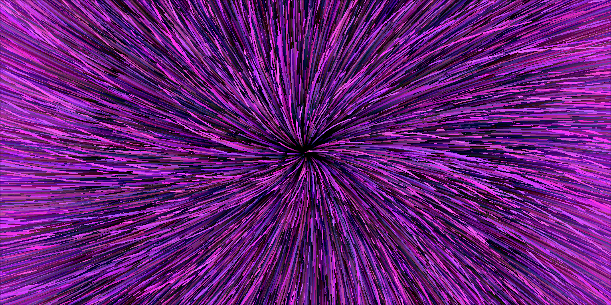

# Warp tunnel simulation
A small graphical app written on C lang. This app renders the beautiful view of the Warp.



# Dependencies
- SDL2 lib

# Build
```bash 
    mkdir build
    cd build

    cmake -G "Unix Makefiles" -S ../ -B Release -DCMAKE_BUILD_TYPE=Release

    cmake --build ./Release
```